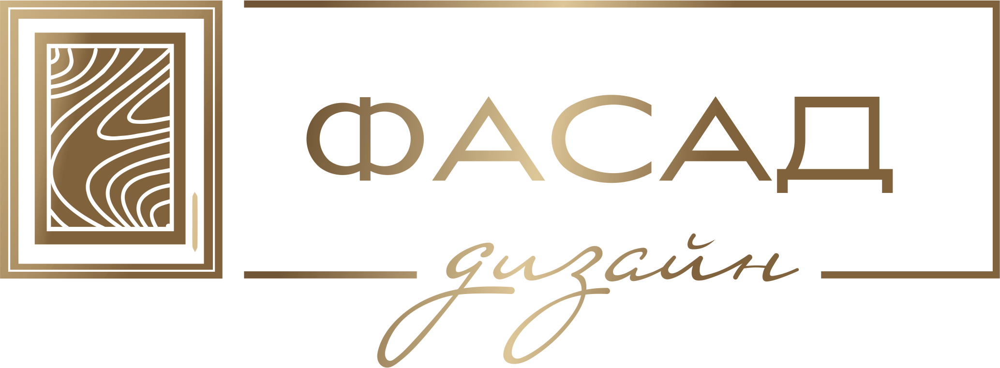

<html lang="ru">
<head>
    <meta charset="UTF-8">
    <meta name="viewport" content="width=device-width, initial-scale=1.0">
    <title>Фасад-дизайн</title>
    
</head>
<body>
    <header>
        

            

                
            

            

                <h1>Фасад-дизайн</h1>
                
Информация о заказах и стоимость продукции

            

        

    </header>
    <nav>
        <a href="#auth">Главная</a>
        <a href="#orders">Мои заказы</a>
        <a href="#calculator">Калькулятор стоимости</a>
        <a href="#contacts">Контакты</a>
    </nav>
    

        <h2>Авторизация</h2>
        
Введите номер телефона для входа:

        <form>
            <label for="phone">Номер телефона:</label> 
            <input type="text" id="phone" name="phone" placeholder="+7 (___) ___-__-__" required>  
            <button type="submit" class="button">Войти</button>
        </form>
    

    

        <h2>Мои заказы</h2>
        
Информация о текущих заказах будет отображаться здесь после авторизации.

    

    

        <h2>Калькулятор стоимости</h2>
        
Введите параметры продукции для расчета:

        <form>
            <label for="material">Материал:</label> 
            <select id="material" name="material">
                <option value="mdf">МДФ</option>
                <option value="hpl">HPL</option>
            </select>  
            <label for="dimensions">Размеры (см):</label> 
            <input type="text" id="dimensions" name="dimensions" placeholder="100x50" required>  
            <button type="submit" class="button">Рассчитать</button>
        </form>
    

    

        <h2>Контакты</h2>
        
<strong>г. Симферополь, ул. Коммунальная, 53</strong>

        <ul>
            <li><a href="https://t.me/+79784643268" target="_blank" class="button">+7 (978) 464-32-68</a></li>
            <li><a href="https://t.me/+79787822268" target="_blank" class="button">+7 (978) 782-22-68</a></li>
            <li><a href="https://t.me/+79788369968" target="_blank" class="button">+7 (978) 836-99-68</a></li>
        </ul>
        
<strong>г. Краснодар, ул. Новороссийская, 172</strong>

        <ul>
            <li><a href="https://t.me/+79182324454" target="_blank" class="button">+7 (918) 232-44-54</a></li>
            <li><a href="https://t.me/+79182324033" target="_blank" class="button">+7 (918) 232-40-33</a></li>
        </ul>
    

    <footer>
        

    Контакты: <a href="mailto:simf@fasad-dizain.ru">simf@fasad-dizain.ru</a> | 
    <a href="https://shop.fasad-dizain.ru/" target="_blank">Сайт фурнитуры</a> | 
    <a href="https://fasad-dizain.ru/" target="_blank">Сайт мебельных фасадов</a>  
    
    г. Симферополь: +7 (978) 464-32-68, +7 (978) 782-22-68, +7 (978) 836-99-68 
    г. Краснодар: +7 (918) 232-44-54, +7 (918) 232-40-33

    </footer>
</body>
</html>
